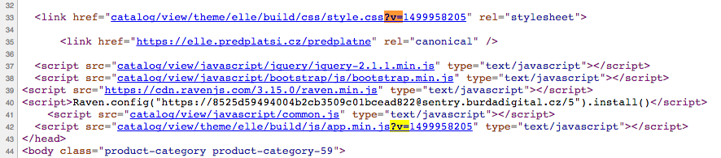

# Version parameter for [OpenCart 2.x](https://github.com/opencart/opencart)

Helper function which fixing visitors browser cache issue after your changes at CSS or javascript

## Preview



You can also use this function for your custom files (CSS / JS, images, ...) like this:
``
<link href="<?php echo versionNumber($style['href']); ?>" type="text/css" rel="<?php echo $style['rel']; ?>
``

## Installation

1. Requiring installed [vQmod](https://github.com/vqmod/vqmod) because vQmod doesn't support installing via composer itself.
2. `composer require burdapraha/oc_version_number dev-master`
3. `composer require sasedev/composer-plugin-filecopier` for files manipulating
4. Add this code to your composer.json project file, extra section:

```
    "extra": {
        "filescopier": [
            {
                "source": "vendor/burdapraha/oc_version_number/upload",
                "destination": "upload",
                "debug": "true"
            }
        ]
    }  
```
    
It will move vQmod xml file to correct folder.

5. optionally you can add row to your `.gitignore` file with path to svg.xml (example: upload/vqmod/xml/oc_version_number.xml)
6. celebrate!